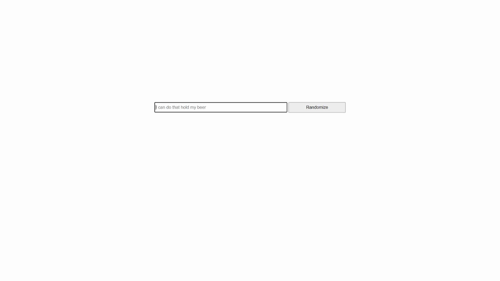

# sentence-scrambler
Beer I hold, that my can do.

https://dhens.github.io/sentence-scrambler/

User story:
**As a hilarious individual, I want access to the powers of sentence scrambling, so I can see the funniest possible version of a sentence**

Enter a sentence, get a scrambled one back!
* Creates funny, ridiculous, and uninteresting phrases from whatever you enter.
* Keeps capitalization standardized regardless of what the user types in.

Written in HTML, CSS, and Vanilla Javascript.
